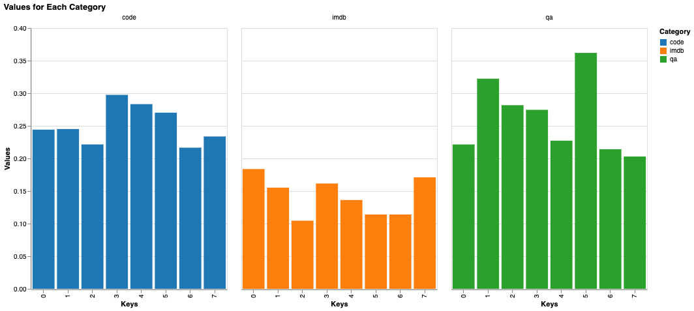
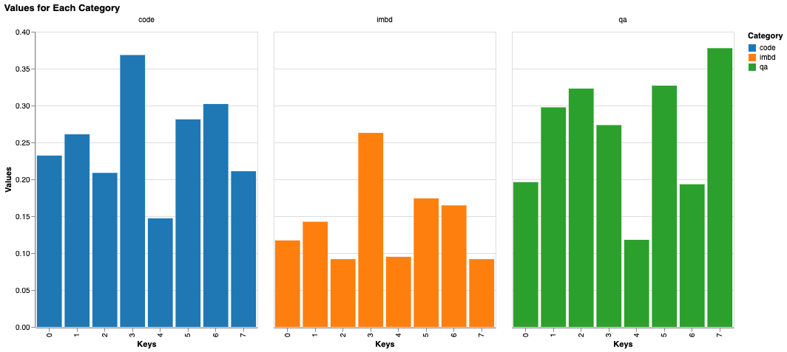

# Mixtral Experiments

I started these experiments after listening to Dwarkesh's podcast with Sholto Douglas and Trenton Bricken (transcript found [here](https://www.dwarkeshpatel.com/p/sholto-douglas-trenton-bricken)). In the podcast, Dwarkesh suggested exploring the model more and seeing what the experts learned.

## Aims

My ideas with these experiments were:

1. Visualize the attention paid to different tokens.
2. View the "route" of different tokens
3. See what percentage of tokens go to which expert in different datasets.

Essentially for 2., I wanted to see if some semantically similar tokens took somewhat similar routes. Like "king" and "queen" or "liquid" and "water". For 3. I wanted to see if for different datasets of different types (qa, code, etc.), there is a preference for any expert. The question in my mind was "Do some experts have an affinity for code?".

With regards to 1., I was just curious to see how the attention Mixtral paid to tokens was different from GPT-2.

## Methodology and Results

I started with the `attention-maps` experiment because I could do that the quickest. I managed to visualize GPT-2 and Mixtral.

Next with 2. Nothing of note here. I managed to execute and save the routes of different tokens through different experts

For 3., I visualized the token percentages for 3. different datasets

1. stanfordnlp/imdb - a dataset for positive and negative reviews of movies
2. databricks/databricks-dolly-15k - a qa dataset with a instruction question and a response
3. bigcode/bigcodebench - a coding dataset.

The token percentages for the 3 are below.

**First Layer Experts**

**Last Layer Experts**

## What's next

Although this was disappointing that there is nothing significant that each expert learned, there is a lot more to explore. Anthropic's recent papers on monosemanticity show promise at extracting what LLMs have learned. What does that mean ?

The next step would be to replicate and apply the same feature extraction pipeline onto Mixtral. Maybe this might yeild some results.

Secondly a paper came out about introducing [ESFT - Expert Specialized Fine Tuning](https://arxiv.org/pdf/2407.01906) where they tune experts most relevant to a downstream task and freeze the rest. This might be interesting to replicate.
